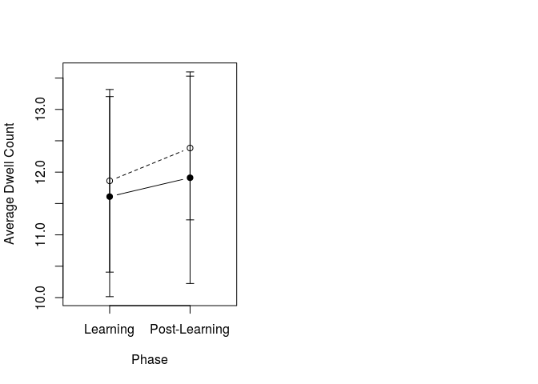
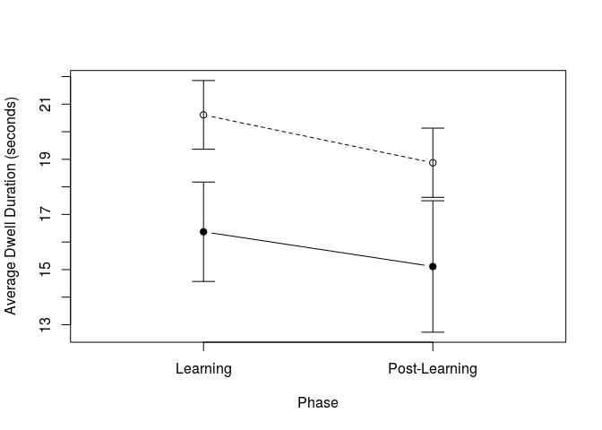
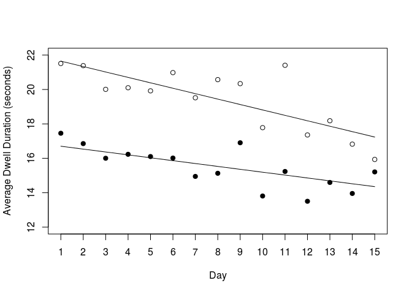

Social Choice Analysis
================
Anthony Santistevan
Tuesday, August 19, 2014

    ## 
    ## Attaching package: 'dplyr'

    ## The following objects are masked from 'package:stats':
    ## 
    ##     filter, lag

    ## The following objects are masked from 'package:base':
    ## 
    ##     intersect, setdiff, setequal, union

    ## Loading required package: geeM

    ## Loading required package: Matrix

Determining learning phase
--------------------------

``` r
set.seed(111)
mod.segment.init <- glm(cbind(Social, Nonsocial) ~ Day,
                        family = binomial(link='logit'),
                        data = Data_Agg)

mod.segment0 <- mod.segment.init

set.seed(111)
mod.segment1 <- segmented(mod.segment.init,
                          seg.Z = ~Day,
                          psi = list(Day=c(7.5)))
set.seed(111)
mod.segment2 <- segmented(mod.segment.init,
                          seg.Z = ~Day,
                          psi = list(Day=c(7.5,7.5)))
set.seed(111)
mod.segment3 <- segmented(mod.segment.init,
                          seg.Z = ~Day,
                          psi = list(Day=c(7.5,7.5,7.5)))
mod.segment <- mod.segment3

# Likelihood-ratio tests to find best-fitting number of knots
anova(mod.segment0, mod.segment1, mod.segment2, mod.segment3, test="LRT")
```

    ## Analysis of Deviance Table
    ## 
    ## Model 1: cbind(Social, Nonsocial) ~ Day
    ## Model 2: cbind(Social, Nonsocial) ~ Day + U1.Day + psi1.Day
    ## Model 3: cbind(Social, Nonsocial) ~ Day + U1.Day + U2.Day + psi1.Day + 
    ##     psi2.Day
    ## Model 4: cbind(Social, Nonsocial) ~ Day + U1.Day + U2.Day + U3.Day + psi1.Day + 
    ##     psi2.Day + psi3.Day
    ##   Resid. Df Resid. Dev Df Deviance Pr(>Chi)   
    ## 1        58     164.36                        
    ## 2        56     159.24  2   5.1159 0.077463 . 
    ## 3        54     149.56  2   9.6815 0.007901 **
    ## 4        52     141.02  2   8.5448 0.013948 * 
    ## ---
    ## Signif. codes:  0 '***' 0.001 '**' 0.01 '*' 0.05 '.' 0.1 ' ' 1

``` r
anova(mod.segment0, mod.segment3, test="LRT")
```

    ## Analysis of Deviance Table
    ## 
    ## Model 1: cbind(Social, Nonsocial) ~ Day
    ## Model 2: cbind(Social, Nonsocial) ~ Day + U1.Day + U2.Day + U3.Day + psi1.Day + 
    ##     psi2.Day + psi3.Day
    ##   Resid. Df Resid. Dev Df Deviance  Pr(>Chi)    
    ## 1        58     164.36                          
    ## 2        52     141.02  6   23.342 0.0006896 ***
    ## ---
    ## Signif. codes:  0 '***' 0.001 '**' 0.01 '*' 0.05 '.' 0.1 ' ' 1

``` r
anova(mod.segment1, mod.segment3, test="LRT")
```

    ## Analysis of Deviance Table
    ## 
    ## Model 1: cbind(Social, Nonsocial) ~ Day + U1.Day + psi1.Day
    ## Model 2: cbind(Social, Nonsocial) ~ Day + U1.Day + U2.Day + U3.Day + psi1.Day + 
    ##     psi2.Day + psi3.Day
    ##   Resid. Df Resid. Dev Df Deviance Pr(>Chi)   
    ## 1        56     159.24                        
    ## 2        52     141.02  4   18.226 0.001115 **
    ## ---
    ## Signif. codes:  0 '***' 0.001 '**' 0.01 '*' 0.05 '.' 0.1 ' ' 1

``` r
anova(mod.segment2, mod.segment3, test="LRT")
```

    ## Analysis of Deviance Table
    ## 
    ## Model 1: cbind(Social, Nonsocial) ~ Day + U1.Day + U2.Day + psi1.Day + 
    ##     psi2.Day
    ## Model 2: cbind(Social, Nonsocial) ~ Day + U1.Day + U2.Day + U3.Day + psi1.Day + 
    ##     psi2.Day + psi3.Day
    ##   Resid. Df Resid. Dev Df Deviance Pr(>Chi)  
    ## 1        54     149.56                       
    ## 2        52     141.02  2   8.5448  0.01395 *
    ## ---
    ## Signif. codes:  0 '***' 0.001 '**' 0.01 '*' 0.05 '.' 0.1 ' ' 1

``` r
sum.segment <- summary(mod.segment)

plot(Data_Agg$Social/(Data_Agg$Trials) ~ Data_Agg$Day, type='n', xlab='Day', ylab='Probability',ylim=c(0,1))
for(mmu in unique(Data_Agg$MMU)){
  points(Social/(Trials)~Day, data = Data_Agg[Data_Agg$MMU==mmu,], ylim=c(0,1),
         pch = 19, type = 'b', col = alpha('grey',0.8), main = paste(mmu), ylab = 'Probability')
}
points(unique(fitted(mod.segment)) ~ c(1:15), type='l')
```


``` r
# Hypothesis test for change in slope
c <- t(c(0,1,1,0,0,0,0,0))
b.hat <- mod.segment3$coefficients
t <- (c%*%b.hat)/(c%*%vcov(mod.segment3)%*%t(c))
```

Group-level trends during each learning phase
---------------------------------------------

``` r
knots <- c(5.27, 7.6, 9.27)
Day <- Data_Agg$Day

# Create design matrix
X.des = cbind(1, Day, sapply(knots, function(k) 
  ((Day - k > 0) * (Day - k))))
X.des <- data.frame(X.des)
X.des$MMU <- Data_Agg$MMU
names(X.des) <- c("(Intercept)", "Day", "k1", "k2", "k3", "MMU")

Data_Knot <- data.frame(
  Day <- X.des$Day,
  k1  <- X.des$k1,
  k2  <- X.des$k2,
  k3  <- X.des$k3,
  MMU <- X.des$MMU,
  Social <- Data_Agg$Social,
  Nonsocial <- Data_Agg$Nonsocial
)

gee.knot.un <- geeglm(cbind(Social, Nonsocial) ~ Day + k1 + k2 + k3,
                      id = MMU,
                      corstr='un',
                      family = 'binomial',
                      data = Data_Knot)

gee.knot.ex <- geeglm(cbind(Social, Nonsocial) ~ Day + k1 + k2 + k3,
                      id = MMU,
                      corstr='ex',
                      family = 'binomial',
                      data = Data_Knot)

gee.knot.ind <- geeglm(cbind(Social, Nonsocial) ~ Day + k1 + k2 + k3,
                       id = MMU,
                       corstr='ind',
                       family = 'binomial',
                       data = Data_Knot)

gee.knot.ar1 <- geeglm(cbind(Social, Nonsocial) ~ Day + k1 + k2 + k3,
                       id = MMU,
                       corstr='ar1',
                       family = 'binomial',
                       data = Data_Knot)

QIC(gee.knot.un)
```

    ##        QIC       QICu  Quasi Lik        CIC     params       QICC 
    ## 475.653931  91.785655 -40.892827 196.934138   5.000000  -3.169598

``` r
QIC(gee.knot.ex)
```

    ##        QIC       QICu  Quasi Lik        CIC     params       QICC 
    ## 1069.68402   91.45349  -40.72674  494.11527    5.00000 1071.26893

``` r
QIC(gee.knot.ind)
```

    ##        QIC       QICu  Quasi Lik        CIC     params       QICC 
    ## 1475.48806   91.41222  -40.70611  697.03792    5.00000 1476.59917

``` r
QIC(gee.knot.ar1)
```

    ##       QIC      QICu Quasi Lik       CIC    params      QICC 
    ## 451.43431  92.41499 -41.20750 184.50966   5.00000 453.01922

``` r
gee.knot <- gee.knot.ar1
sum.knot <- summary(gee.knot)

## Slope in phase 1
c <- t(c(0, 1, 0, 0, 0))
b.hat <- gee.knot$coefficients
vcov.gee <- gee.knot$geese$vbeta
k1 <- exp(c %*% b.hat)
W <- (c %*% b.hat / sqrt(c %*% vcov.gee %*% t(c)))^2
k1.pval <- 1 - pchisq(W, 1)

## Slope in phase 2
c <- t(c(0, 1, 1, 0, 0))
b.hat <- gee.knot$coefficients
vcov.gee <- gee.knot$geese$vbeta
k2 <- exp(c%*%b.hat)
W <- (c %*% b.hat / sqrt(c %*% vcov.gee %*% t(c)))^2
k2.pval <- 1 - pchisq(W, 1)

## Slope in phase 3
c <- t(c(0, 1, 1, 1, 0))
b.hat <- gee.knot$coefficients
vcov.gee <- gee.knot$geese$vbeta
k3 <- exp(c%*%b.hat)
W <- (c %*% b.hat / sqrt(c %*% vcov.gee %*% t(c)))^2
k3.pval <- 1 - pchisq(W, 1)

## Slope in phase 4
c <- t(c(0, 1, 1, 1, 1))
b.hat <- gee.knot$coefficients
vcov.gee <- gee.knot$geese$vbeta
k4 <- exp(c%*%b.hat)
W <- (c %*% b.hat / sqrt(c %*% vcov.gee %*% t(c)))^2
k4.pval <- 1 - pchisq(W, 1)

data.frame(phase = c(1, 2, 3, 4),
           slope = c(k1, k2, k3, k4),
           p.val = format.pval(c(k1.pval, k2.pval, k3.pval, k4.pval)))
```

    ##   phase     slope      p.val
    ## 1     1 1.0025042   0.951165
    ## 2     2 1.5243043 1.1666e-06
    ## 3     3 0.6609314 < 2.22e-16
    ## 4     4 1.0225633   0.025986

``` r
mod.glm1 <- glm(cbind(Social, Nonsocial) ~ MMU - 1,
                family = 'binomial',
                data = Data_Agg)

sum.glm1 <- summary(mod.glm1)

cbind(plogis(cbind('Estimate' = mod.glm1$coefficients,
                   confint(mod.glm1))),
      "p-value" = format.pval(p.adjust(sum.glm1$coefficients[,4])))
```

    ## Waiting for profiling to be done...

    ##          Estimate            2.5 %               97.5 %             
    ## MMU32992 "0.494444444444445" "0.461830937140474" "0.527089503342027"
    ## MMU33089 "0.517045454545454" "0.484015892076256" "0.549976011528529"
    ## MMU33825 "0.590069284062532" "0.557082814089149" "0.622524170350778"
    ## MMU34700 "0.678611422120128" "0.647500934352812" "0.708699614997268"
    ##          p-value     
    ## MMU32992 "0.73889"   
    ## MMU33089 "0.62393"   
    ## MMU33825 "4.0504e-07"
    ## MMU34700 "< 2.22e-16"

Animal-specific trends across the experiemnt
--------------------------------------------

``` r
Data_Agg <- within(Data_Agg, MMU <- relevel(MMU, ref = '32992'))
glm2.32992 <- glm(cbind(Social, Nonsocial) ~ Day + MMU + Day:MMU,
                  family = 'binomial',
                  data = Data_Agg)
sum.glm2.32992 <- summary(glm2.32992)

Data_Agg <- within(Data_Agg, MMU <- relevel(MMU, ref = '33089'))
glm2.33089 <- glm(cbind(Social, Nonsocial) ~ Day + MMU + Day:MMU,
                  family = 'binomial',
                  data = Data_Agg)
sum.glm2.33089 <- summary(glm2.33089)

Data_Agg <- within(Data_Agg, MMU <- relevel(MMU, ref = '33825'))
glm2.33825 <- glm(cbind(Social, Nonsocial) ~ Day + MMU + Day:MMU,
                  family = 'binomial',
                  data = Data_Agg)
sum.glm2.33825 <- summary(glm2.33825)

Data_Agg <- within(Data_Agg, MMU <- relevel(MMU, ref = '34700'))
glm2.34700 <- glm(cbind(Social, Nonsocial) ~ Day + MMU + Day:MMU,
                  family = 'binomial',
                  data = Data_Agg)
sum.glm2.34700 <- summary(glm2.34700)

Slopes <- data.frame(
  MMU      = unique(Data_Agg$MMU),
  Estimate = c(sum.glm2.32992$coefficients[[2]],
               sum.glm2.33089$coefficients[[2]],
               sum.glm2.33825$coefficients[[2]],
               sum.glm2.34700$coefficients[[2]]),
  p.value  = c(sum.glm2.32992$coefficients[2, 4],
               sum.glm2.33089$coefficients[2, 4],
               sum.glm2.33825$coefficients[2, 4],
               sum.glm2.34700$coefficients[2, 4])
  )

Slopes$Estimate <- exp(Slopes$Estimate)
Slopes$p.adj <- p.adjust(Slopes$p.value, n = 4) %>%
  format.pval()
```

Animal-specific preference across days 1-5
------------------------------------------

``` r
mod.glm.cut1 <- glm(cbind(Social, Nonsocial) ~ MMU - 1,
                    family = 'binomial',
                    data = Data_Agg[Data_Agg$Day <=5,])
sum.glm1.cut1 <- summary(mod.glm.cut1)
p.vals <- format.pval(p.adjust(sum.glm1.cut1$coefficients[, 4], method = "bonf"))

cbind(plogis(cbind('Estimate' = mod.glm.cut1$coefficients,confint(mod.glm.cut1))),
      p.vals) %>%
  data.frame()
```

    ## Waiting for profiling to be done...

    ##                   Estimate            X2.5..           X97.5..     p.vals
    ## MMU34700 0.703333333333333 0.650066549533256 0.753144797317756 3.4051e-11
    ## MMU33825               0.5  0.44360106899808 0.556398931001921  1.0000000
    ## MMU33089              0.38 0.326264373107071 0.435774910205554  0.0001544
    ## MMU32992 0.453333333333333 0.397576435908076 0.509883312670019  0.4259168

Animal-specific preference across days 6-15
-------------------------------------------

    ## Waiting for profiling to be done...

    ##                   Estimate            X2.5..           X97.5..      p.adj
    ## MMU34700 0.666104553118175 0.627489659914937 0.703288704201594 8.6768e-15
    ## MMU33825 0.637809187273234 0.597655732172367 0.676719100828968 3.9070e-10
    ## MMU33089 0.587931034482753 0.547551704604876 0.627536005814653 0.00010075
    ## MMU32992             0.515 0.475010355649283 0.554861938847177 1.00000000

    ##        QIC       QICu  Quasi Lik        CIC     params       QICC 
    ## 1852.21127  111.32248  -40.66124  885.44440   15.00000 1863.12036

    ##       QIC      QICu Quasi Lik       CIC    params      QICC 
    ## 422.25951 111.32719 -40.66360 170.46616  15.00000 -53.80606

    ##        QIC       QICu  Quasi Lik        CIC     params       QICC 
    ## 1855.27269  111.35931  -40.67965  886.95669   15.00000 1867.92385

    ##        QIC       QICu  Quasi Lik        CIC     params       QICC 
    ## 4828.38203  113.88155  -41.94077 2372.25024   15.00000 4841.03319


    ##       Estimate      2.5%     97.5%
    ## [1,] 0.5687514 0.5183958 0.6177245

Social preference across test days 1-5
--------------------------------------

    ##           2.5%  Estimate     97.5%
    ## [1,] 0.4131189 0.4989545 0.5848518

Social preference across test days 6 - 15
-----------------------------------------

    ##       Estimate      2.5%     97.5%
    ## [1,] 0.6021681 0.5858995 0.6182141

Dwell Count
-----------

    ##         QIC        QICu   Quasi Lik         CIC      params        QICC 
    ##  200.122630  209.155740 -102.577870   -2.516555    2.000000 -271.550839

    ##        QIC       QICu  Quasi Lik        CIC     params       QICC 
    ## 199.542214 187.628002 -91.814001   7.957106   2.000000 199.756499

    ##       QIC      QICu Quasi Lik       CIC    params      QICC 
    ## 195.84910 193.10054 -94.55027   3.37428   2.00000 196.28547

    ##        QIC       QICu  Quasi Lik        CIC     params       QICC 
    ## 186.404501 187.643646 -91.821823   1.380428   2.000000 186.840865



Dwell Duration
--------------

    ## 
    ## Call:
    ## geeglm(formula = value ~ Choice + phase, data = MovieDwellDur[!(is.nan(MovieDwellDur$value)), 
    ##     ], id = factor(MMU), corstr = "ind", std.err = "san.se")
    ## 
    ##  Coefficients:
    ##             Estimate Std.err   Wald Pr(>|W|)    
    ## (Intercept)  16.5265  0.9648 293.40  < 2e-16 ***
    ## Choice1       3.9300  0.8611  20.83 5.02e-06 ***
    ## phase        -1.5057  0.3569  17.80 2.45e-05 ***
    ## ---
    ## Signif. codes:  0 '***' 0.001 '**' 0.01 '*' 0.05 '.' 0.1 ' ' 1
    ## 
    ## Estimated Scale Parameters:
    ##             Estimate Std.err
    ## (Intercept)    6.483  0.8364
    ## 
    ## Correlation: Structure = independenceNumber of clusters:   4   Maximum cluster size: 30

    ##       QIC      QICu Quasi Lik       CIC    params      QICC 
    ##  431.2843  433.5512 -214.7756    0.8666    2.0000  -40.3891

    ##       QIC      QICu Quasi Lik       CIC    params      QICC 
    ##    332.79    327.77   -161.88      4.51      2.00    333.00

    ##       QIC      QICu Quasi Lik       CIC    params      QICC 
    ##   353.345   355.338  -175.669     1.003     2.000   353.781

    ##       QIC      QICu Quasi Lik       CIC    params      QICC 
    ##   325.935   327.770  -161.885     1.082     2.000   326.371

    ##       QIC      QICu Quasi Lik       CIC    params      QICC 
    ##   446.343   447.846  -221.923     1.248     2.000   -25.331

    ##       QIC      QICu Quasi Lik       CIC    params      QICC 
    ##     460.3     443.8    -219.9      10.3       2.0     460.6

    ##       QIC      QICu Quasi Lik       CIC    params      QICC 
    ##   464.178   464.664  -230.332     1.757     2.000   464.614

    ##       QIC      QICu Quasi Lik       CIC    params      QICC 
    ##   447.083   443.757  -219.879     3.663     2.000   447.520


